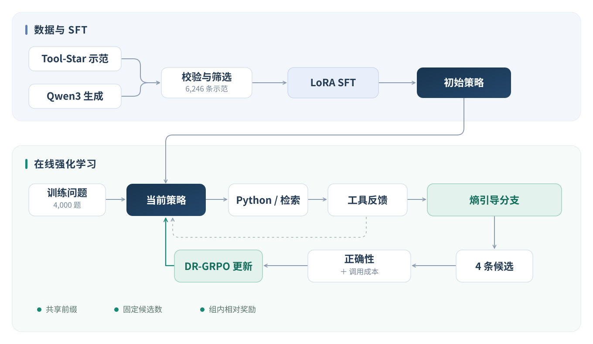

<div align="center">

# ToolTune-RL

**熵引导采样的 LLM 工具调用优化**

Qwen3-4B · LoRA SFT · GRPO · Python & Search

[整体方案](#整体方案) · [核心实现](#核心实现) · [实验结果](#实验结果) · [运行说明](docs/running.md)

</div>

让模型学会使用工具，并在多轮交互中兼顾**答案质量与调用效率**。

项目以 Qwen3-4B 为基座，接入 Python 执行与本地检索工具，覆盖数学推理、多跳问答和检索计算。训练分为两个阶段：先通过 SFT 学习工具协议与反馈利用，再通过 GRPO 优化多轮决策；在训练采样阶段借鉴 ARPO 的熵引导分支采样，探索工具反馈后的不同续写路径。

## 整体方案



### 1. 构建工具交互流程

模型每轮生成工具调用或最终答案。Python 负责计算，本地检索只访问当前问题的文档；工具结果回填到上下文，模型据此继续决策。原生工具协议、调用预算与最终答案解析由统一执行流程管理。

### 2. SFT：学习协议与反馈利用

将 Tool-Star 公开示范对齐到 SFT 题池，对格式、最终答案及可重放的 Python 调用进行校验；未覆盖问题由基座模型生成候选轨迹，保留首条通过验证的轨迹。

最终得到 **6,246 条样本**：**2,817 条公开示范 + 3,429 条生成轨迹**。通过 LoRA 微调，仅监督模型生成的 token，学习规范调用、理解工具反馈和输出最终答案，为 RL 提供初始策略。

### 3. GRPO：正确性与调用成本联合优化

在 **4,000 道训练题**上在线采样，每题形成 4 条候选轨迹，使用组内相对奖励进行策略更新，具体采用 **DR-GRPO 损失**。

- **正确性优先**：最终答案通过验证后获得主要奖励。
- **相对成本约束**：以同组正确轨迹中的最少调用次数为参照，对额外调用施加惩罚。
- **反馈作为上下文**：工具返回内容参与后续决策，但不直接计入模型 token 的策略损失。

### 4. 熵引导分支采样

先采样根轨迹，再计算工具反馈前后生成片段的 token 熵变化，选择候选分支点。复用该位置之前的交互前缀，重新生成后续轨迹；没有合适分支时，以独立采样补足候选。

每题候选总数保持不变。熵用于**选择探索位置**，轨迹优劣仍由正确性与调用成本奖励决定。分支采样用于训练阶段，测试沿用单轨迹解码。

消融覆盖：无成本奖励、成本奖励、随机分支、全局熵分支、工具条件熵分支。详见 [方法说明](docs/method.md)。

## 实验结果

在自建 **2,000 题测试集**上，按直接作答、数学计算、多跳问答、检索计算四类任务计算宏平均通过率：

| 模型 / 方案 | 宏平均通过率 | 工具调用总数 |
| :--- | ---: | ---: |
| Qwen3-4B | 68.94% | 1,002 |
| SFT | 80.98% | 1,854 |
| 成本奖励 + 独立采样 | 81.08% | 1,968 |
| **成本奖励 + 全局熵分支** | **81.94%** | **1,872** |

全局熵方案相对成本奖励独立采样基线，通过率提高 **0.85 个百分点**，工具调用总数减少 **4.88%**（同一测试集上 `1,968 → 1,872`）。

## 核心实现

| 模块 | 内容 |
| :--- | :--- |
| [数据处理](scripts/data/) | 题池划分、公开示范校验、基座轨迹生成与 SFT 合并 |
| [交互与采样](src/tooltune/rollout.py) | 多轮工具执行、token 来源掩码、共享前缀与分支选择 |
| [奖励函数](src/tooltune/rewards.py) | 正确性奖励、无效调用惩罚与相对调用成本 |
| [工具协议](src/tooltune/protocol.py) | Qwen 原生调用格式、反馈回填、SFT 标签掩码 |
| [工具执行](src/tooltune/tools/) | 文档内 BM25 检索与隔离 Python 计算 |
| [训练入口](scripts/train_rl.py) | TRL DR-GRPO、vLLM 采样、固定 SFT 参考策略 |

```text
ToolTune-RL/
├── assets/           # 整体方案图
├── configs/          # SFT、RL 与消融配置
├── docs/             # 方法与运行说明
├── examples/         # 自包含的格式和流程示例
├── scripts/          # 数据、训练、导出与评测入口
├── src/tooltune/     # 交互、采样、奖励和工具实现
└── tests/            # 核心逻辑检查
```

## 快速开始

先运行无需模型权重的流程示例，查看文档检索与组内奖励计算：

```bash
python -m pip install -e ".[dev]"
python examples/walkthrough.py
python -m pytest
```

完整训练路径：**题池划分 → 轨迹校验与生成 → LoRA SFT → 模型导出 → 熵统计初始化 → GRPO → 评测**。环境、数据格式与命令见 [运行说明](docs/running.md)。

## 参考与致谢

- [Qwen3-4B](https://huggingface.co/Qwen/Qwen3-4B-Instruct-2507)：基座模型。
- [Tool-Star](https://github.com/RUC-NLPIR/Tool-Star)：公开示范与工具推理协议参考。
- [ARPO](https://github.com/RUC-NLPIR/ARPO)：熵引导分支采样的方法来源。本项目采用全词表熵变化与历史分位数触发，并比较全局及工具条件统计。
- [TRL](https://github.com/huggingface/trl) 与 [vLLM](https://github.com/vllm-project/vllm)：训练与推理框架。

项目代码遵循 [MIT License](LICENSE)，第三方内容归属见 [NOTICE](NOTICE)。数据和模型由各自上游提供。
